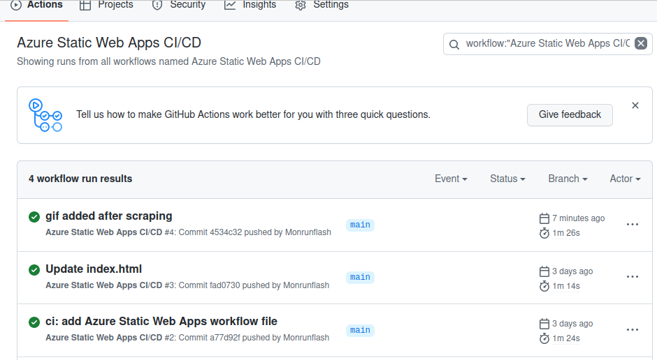

¡Buenos días! Espero que todos estéis pasando unas estupendas fiestas. Por mi parte, además de disfrutar de la compañía de mis allegados y de las delicatesen propias del momento, sigo absorto estudiando los servicios que nos ofrece Azure; en concreto, profundizando en las **Static Web Apps**. 

Primeramente, aquí os muestro la aplicación web que he desplegado para celebrar las navidades: [WebCrismas](https://agreeable-stone-063078110.2.azurestaticapps.net/). El aspecto algo cutrón de inicio de los 2000 y de la WEB1.0 creo que le confiere una magia navideña especial.

{:style="display:block; margin-left:auto; margin-right:auto"}{:class="scraping-img"}
{:refdef: style="text-align: center;margin-bottom: 40px;"}
_Mi página navideña_{:class="img-footer"}
{:refdef}

A partir de lo cual, ahora procedo a explicar que son esto de las **Static Web Apps** y por qué es un servicio tan interesante. Según Azure es “Servicio de aplicaciones web moderno que ofrece desarrollo optimizado de la pila completa, desde el código fuente hasta alta disponibilidad global”. En resumidas cuentas, que mediante una fuente de , como puede ser un **repositorio de Github**, podemos construir nuestra página web estática _serverless_ y hospedada en la **nube pública en HA**. La compilación e implementación se lleva a cabo mediante un simple cambio en el repositorio, que desencadenará la compilación e implementación de la web, por lo que el desarrollo es muy **ágil** y nos permite un entorno de ensayo aplicando **CD/CI**. 

Procedo a enseñar el recorrido del proceso de despligue: 

* Al crear el servicio en **Azure** selecionamos la cuenta y el repositorio sobre el que queremos realizar el despliegue, puede ser publico o privado.

{:style="display:block; margin-left:auto; margin-right:auto"}
{:refdef: style="text-align: center;margin-bottom: 40px;"}
_Portal Azure_{:class="img-footer"}
{:refdef}

* Este se conectará al repositorio y creará un **workflow**, que son las instrucciones que se van a realizar ante un evento en el repositorio; en este caso ante una actualización, un **push** en el repositorio, se va a construir y desplegar de nuevo la web estática en un **contenedor con Ubuntu**. Sobre una imagen Ubuntu, es gracioso, lo sé. 

{:style="display:block; margin-left:auto; margin-right:auto"}
{:refdef: style="text-align: center;margin-bottom: 40px;"}
_workflow en formato .yml guardado en el repositorio_{:class="img-footer"}
{:refdef}

* Tras cualquier **push** en el repositorio empezará la acción de construir el sitio.

{:style="display:block; margin-left:auto; margin-right:auto"}
{:refdef: style="text-align: center;margin-bottom: 40px;"}
_Panel con todas las acciones llevadas a cabo en nuestro repositorio_{:class="img-footer"}
{:refdef}

* Si observamos con detalle la acción veremos como se lleva a cabo el despliegue. Los pasos relevantes son: la construcción de la imagen, la conexión mediante tokens de seguridad a Azure y el despliegue del contenedor sobre el que correrá la página estática.

{:style="display:block; margin-left:auto; margin-right:auto"}
{:refdef: style="text-align: center;margin-bottom: 40px;"}
_Imagen sobre la que va a correr el servidor web (Ubuntu 22)_{:class="img-footer"}
{:refdef}

{:style="display:block; margin-left:auto; margin-right:auto"}
{:refdef: style="text-align: center;margin-bottom: 40px;"}
_Descarga o pulling de los repositorios e instalación de los mismos_{:class="img-footer"}
{:refdef}
 
Una vez completado satisfactoriamente el proceso ya podrémos acceder al sitio web mediante el nombre de dominio que nos proporcionan en el portal. Este **domain name** puede ser modificado con un **custom domain** propio.

Por otra parte, ahora voy a explicar como he construido la apariencia de la web. He querido que fuese una página graciosa y entrañable, que contuviese multitud de GIFs navideños. Para ello he realizado un **scraping** sobre una famosa web de gifs e imagenes y de la que he descargado una gran variedad de ficheros. 

Ejecutando el comando **wget** para realizar la descarga de los GIFs: 

```bash
wget -nd -H -r -A "*.gif" -e robots=off https://example.com

```

Aquí podemos ver el resultado de su ejecución y como se llena la carpeta sobre la que lo ejecutamos: 

{:style="display:block; margin-left:auto; margin-right:auto"}

Tras la descargar de más de 100 ficheros he hecho un pequeño script en Python que recorre todos los archivos del directorio de imágenes y crea una etiqueta **HTML** con el **src** específico para cada archivo (si está tarea fuese a mano este proceso no podría ser escalable, ya que con más de 100 imágenes sería un tedio y con más de 1000 una odisea). 

{:style="display:block; margin-left:auto; margin-right:auto"}
{:refdef: style="text-align: center;margin-bottom: 40px;"}
_Ejecución del script en Python_{:class="img-footer"}
{:refdef}

Por último, lo he copiado en el index.html, actualizado el repositorio y _voilà_. Mi Christmas navideño personalizado, agíl y hosteado en la nube.

{:style="display:block; margin-left:auto; margin-right:auto"}
{:refdef: style="text-align: center;margin-bottom: 40px;"}
_Archivo index.html con las etiquetas html_{:class="img-footer"}
{:refdef}

¡Fin!

