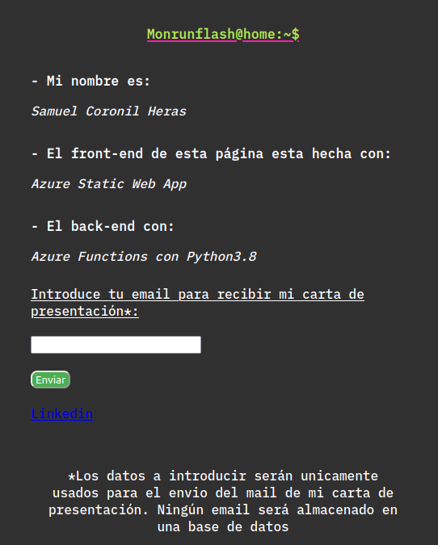
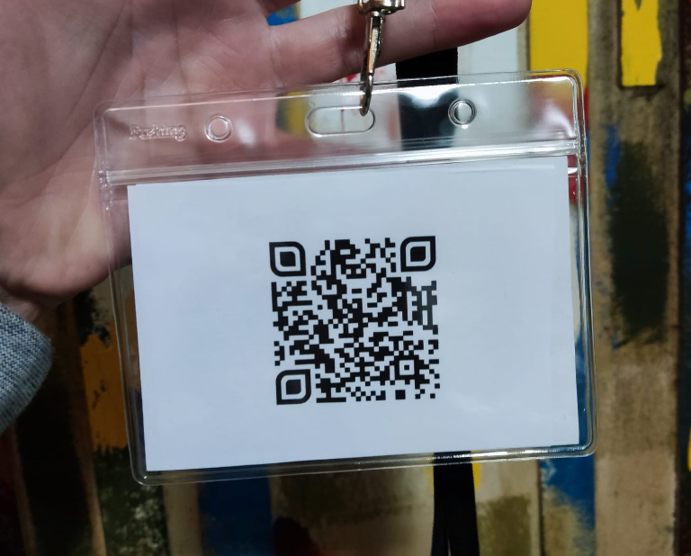
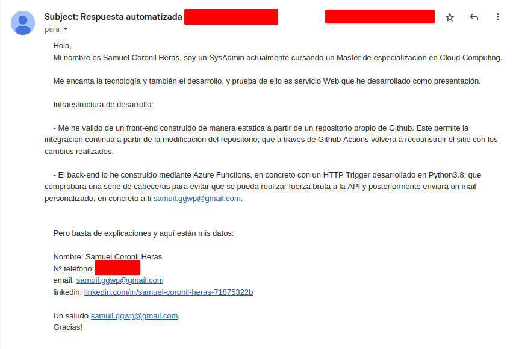
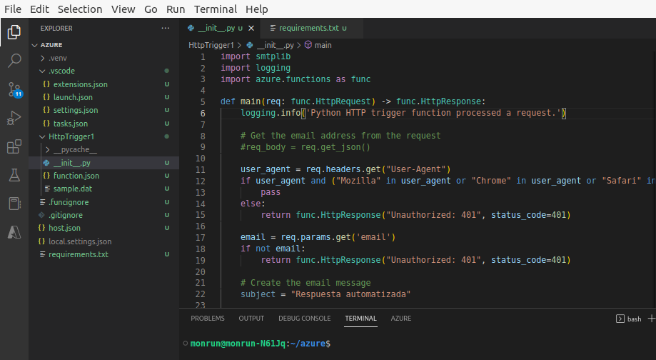

Hoy vengo a hablaros un poco de uno de mis últimos proyectos, el cual, dicho sea de paso, me ha fascinado, a pesar de haberlo tenido que montar en un **tiempo récord**. Este proyecto es nada más y nada menos que la **carta de presentación** que usé durante toda la **Feria de Empleo EmpleaTech**, que es un evento que concentra a muchos estudiantes de las TICs y a importantes compañías tecnológicas. 

  

Antes que nada, ¿de dónde surgió la idea? Esta idea vino a mi mente al escuchar a varios de mis compañeros hablar sobre la posibilidad de imprimir tarjetas de presentación con **enlaces QR** a sus redes sociales. Esto puede ser una excelente carta de presentación que marque la diferencia a la hora de ser seleccionado, ya que al causar una buena impresión es más probable que los _recruiters_ te agreguen y se interesen por ti para ofrecerte futuras ofertas de trabajo.  

  

Por lo tanto, dado que varios compañeros iban a llevar acabo esa estrategia, y ahora mismo me encuentro inmerso en la nube, se me ocurrió ir un paso más allá y montar mi carta de presentación con los **Servicios Web de Azure**. Montaría una **landing page** con un **Static Web App** a partir de un repositorio de GitHub, que me permitiese llevar a cabo una implementación donde y cuando quisiese (como acabaría ocurriendo, ya que en mitad de la feria me toco corregir el código desde el móvil). Entonces, ¿Qué me ha parecido? que este servicio es increíble, y dado que mis requerimientos no eran elevados podría tener un **Sku** gratuito con un gran ancho de banda. 

 

{:style="display:block; margin-left:auto; margin-right:auto"}{:class="scraping-img"}
{:refdef: style="text-align: center;margin-bottom: 40px;"}
_Landing Page_{:class="img-footer"}
{:refdef}

 

Seguidamente, tras haber maquetado la página creé un **código QR** que llevaría en la acreditación de **Staff** visible ante todos. Este código tendría enlazado el **FQDN** (al dominio provisto automáticamente por Azure). Una vez el visitante acceda a la web introducirá el email en el input facilitado y al dar a enviar, se enviarán sus datos a un back-end propio mediante **API REST** a un servicio de **Azure Functions** desarrollado en **Python3.8**. 

 

{:style="display:block; margin-left:auto; margin-right:auto"}{:class="scraping-img"}
{:refdef: style="text-align: center;margin-bottom: 40px;"}
_Acreditación de Staff con el código QR_{:class="img-footer"}
{:refdef}

 

Aquí es cuando la magia se hace realidad. El servicio, que está siempre a la escucha, recibe la **nueva petición HTTP** y la recoge. Entonces, se procederá a analizar las cabeceras de la petición por motivos de seguridad y para evitar que la API sea bombardeada con peticiones. Después de ser analizada y recibir el visto bueno, se procede a recoger el valor del **parámetro email** para conocer la dirección del usuario. Tras esto se iniciará la **autenticación y negociación** contra los servidores **SMTP de Google** (este paso es muy importante ya que ser un dominio de confianza y autenticarse es fundamental para que los emails sean válidos y no sean rechazados o enviados a SPAM por el servidor SMTP que los recibe). Si todo está correcto, el email será enviado y se **retornará un mensaje de éxito**. 

 

{:style="display:block; margin-left:auto; margin-right:auto"}{:class="scraping-img"}
{:refdef: style="text-align: center;margin-bottom: 40px;"}
_Email automatizado con mis datos_{:class="img-footer"}
{:refdef}

Por último, añadir que la forma más comoda es cargar el proyecto en local, y editar la **Function** con Visual Studio Code. Esto nos permite **debuggear** y probar el código por si todo funciona correctamente. Si lo hiciesemos directamente desde el portal de Azure nuestra tarea se complicaría demasiado y nos sería imposible desarrollar funciones robustas y complejas.

{:style="display:block; margin-left:auto; margin-right:auto"}{:class="scraping-img"}
{:refdef: style="text-align: center;margin-bottom: 40px;"}
_La función cargada en local que nos permite su testeo directo_{:class="img-footer"}
{:refdef}

En conclusión, creo que la iniciativa está bastante bien planteada y ha sido muy divertida de montar. He aprendido mucho poniéndola en marcha, y por qué no decirlo, también ha habido alguna que otra frustración cuando alguna de las piezas no encajaban. En definitiva, me llevo una gran lección de los servicios de Azure, ya que me he dado cuenta de que no existen tutoriales para todo, de manera que debes indagar en multitud de sitios y **poseer una gran inventiva** para encontrar justo lo que uno quiere montar. 